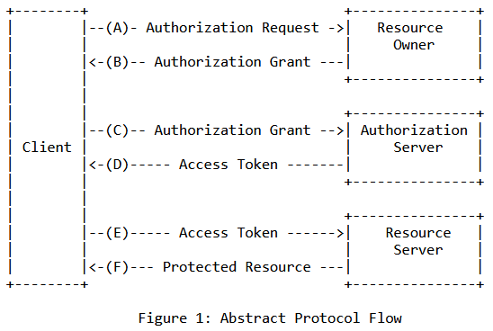

### \# Token 인증 이란?

client는 server에 접속을 하기 위해서는 해당 요청이 유효한지 인증을 받는 절차를 가져야 한다. 아무 요청이나 다 받아주면 server에 문제가 생길 수 있기 때문이다. 그래서 Token이라는 이용권을 발급하여 client가 server에 접속할 수 있도록 한다. 비유를 하자면 놀이공원에 들어갈 때 쓰는 자유이용권을 생각하면 된다.  
Token 방식에는 2가지 방법이 있다. OAuth(**O**pen **Auth**orization**)와** JWT(**J**SON **W**en **T**oken) 이다. 여기서는 OAuth 2.0에 대해서 설명한다. 전자는 protocol, 후자는 standard에 들어간다. protocol과 standard의 차이점은 밑의 글을 참고해보시라.

<link 넣기>

---

### \# OAuth 란?

OAuth의 정의는 다음과 같다.

> Internet user들이 password를 제공하지 않고 타 website 상의 user의 정보에 대해 website나 application의 접근 권한을 부여할 수 있는 공통적인 수단으로써 사용되는, 접근 위임을 위한 개방형 표준이다.  
>                                                                                                                                                              - Wiki pedia

조금 더 쉽게 설명해 보자면, 우리가 주로 쓰는 카카오톡, 구글, 페이스북 등의 소셜 아이디로 로그인 하는 방식을 간편하게 사용할 수 있도록 도와주는 protocol이다. 이 밖에도 다른 외부 Web application에서 제공하는 기능들을 사용할 수 있고, password를 제공하지 않기 때문에 보안성이 높다는 장점 또한 있다.  
단점은 복잡한 로직 과정이 있고 refresh, access token을 다 저장해야 해서 크기가 크다는 단점이 있다.

먼저 OAuth의 구성 요소들과 주요 용어를 살펴보자.

| 구성 요소 / 용어 | 설명 |
| --- | --- |
| authentication | 인증, 접근 자격이 있는지 검증하는 단계. |
| authorization | 인가, resource에 접근할 권한을 부여하는 것.   인가가 완료되면 resource 접근 권한이 담긴 access token이 client에게 부여된다. |
| resource owner | web service를 이용하려는 유저, resource(개인정보)을 소유하는 자, 사용자. |
| authorization server | 인증/인가를 수행하며 client의 접근 자격을 확인하고 권한을 부여하는 역할을 수행한다.   resource owner는 이 server로 id, password를 넘겨 authorization code를 발급 받을 수 있다.   client는 이 server로 authorization code를 넘겨 access token을 발급 받을 수 있다. |
| client | 자사 또는 개인이 만든 application server.   resource server에게 필요한 자원(보호된 자원)을 호스팅하는 관계. |
| resource server | resource owner의 보호된 자원을 호스팅하는 server.   소셜 로그인을 할 때, 해당 회사(Google, Facebook, Kakao, etc.)의 server를 말한다. |
| access token | resource owner에게 resource 접근 권한을 인가했음을 나타내는 만료 기간이 있는 자격증명(token)   보통 15~30분 정도의 만료 기간을 가진다. |
| refresh token | access token 만료시 이를 갱신하기 위한 용도로 사용하는 token.   refresh token이 없다면 resource owner는 다시 로그인을 시도해야 한다.   하지만 refresh token이 있다면 이 token을 통해 access token을 재발급 받을 수 있다.   보통 30일 정도의 만료 기간을 가진다. |

### \# OAuth 의 Protocol Flow

(A) client가 resource owner에게 authorization request를 한다. authorization request는 resource owner에게 직접 authorization request를 할 수 있다. 제일 바람직한 방식은 authorization server를 중개자로 두어 간접적으로 request를 하는 방식이다.

(B) client는 authorization grant를 받는다. resource owner의 authorization을 나타내는 자격 증명으로, 밑의 authorization Grant types 중 하나를 사용하거나, extension grant type을 사용한다.

(C) client는 autorization server로 authentication하고 access token request를 보낸다.

(D) authorization server는 client를 인증하고 권한 부여의 validation을 검사하며, 유효한 경우 access token을 발급한다.

(E) client는 protected resource를 resource server로 부터 요청하고 access token을 제시하여 authentication한다.

(F) resource server는 access token의 유효성을 검사하고, 유효한 경우 request를 처리한다.

### \# Authorization Grant types

authorization grant types에는 총 4가지 방식이 있다.  
\- 권한 부여 승인 코드 (Authorization Code)  
\- 암묵적 승인 (Implicit)  
\- 자원 소유자 자격증명 승인 (Resource Owner Password Credentials)  
\- 클라이언트 자격증명 승인 (Client Credentials)

### \## Authorization Code

authorization code는 autorization server를 사용하여 가져온다. autorization code는 client와 resource owner 사이의 중개자 역할을 수행하게 된다.. resource owner에게 직접 권한을 요청하는 대신, client는 resource owner를 authorization server로 보내고, resource owner를 client에게 전달하기 전에 autorization code, autorization server가 인증을 한 뒤 authorization code를 사용하여 resource owner를 다시 client로 보낸다.

> resource owner은 autorization server만 인증하므로,  
> resource owner의 인증 정보는 client와 공유되지 않는다.

authorization code는 client를 인증하는 기능과 같은 몇 가지 중요한 보안 이점을 제공한다. resource owner의 user-agent를 통해 전달하지 않고, resource owner를 포함한 다른 사람들에게 잠재적으로 노출하지 않고 access token을 client에게 직접 전송한다.

> **A user agent is any software that retrieves and presents Web content for end users or is implemented using Web technologies.** User agents include Web browsers, media players, and plug-ins that help in retrieving, rendering and interacting with Web content.