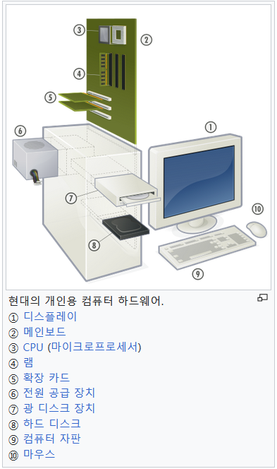

### What is VM(Virtual Machine)?

JVM을 설명하기 전에, Virtual Machine이 뭔지 생각해보자.  
가상 머신은 소프트웨어로 만들어진 컴퓨터이다.  
현실의 컴퓨터는 하드웨어로 이루어져 있다. CPU, RAM, 메인보드, SSD 혹은 하드 디스크, 키보드, 마우스 등등의 실제로 볼 수 있고 만질 수 있는 물리적인 부품들과 운영체제 등의 소프트웨어로 이루어져 있다. 이런 특징을 가진 컴퓨터를 소프트웨어로, 눈에 보이지 않지만 컴퓨터의 기능을 하게끔 만든 게 바로 가상 머신(Virtual Machine)이다. 실제로 가상 머신 또한 자체 운영체제, 스토리지, 네트워킹, 구성 설정 및 소프트웨어가 있다.

그렇다면 가상이란 무엇인가?  
가상화(VIrtualization)이란 리소스(서버, 메모리 등)를 논리적으로 통합 혹은 분할 작업을 통해 한 개의 큰 자원 혹은 여러 개의 작은 자원으로 나누는 기술이다.  
가상화의 장점과 단점은 더보기 란을 참조하자.

더보기

장점을 나열해보면,  
1\. 어플리케이션 설치 없이, 별도의 설정 과정이 필요없어진다.  
2\. 버전을 선택하여 사용할 수 있고, 여러 버전이 공존할 수 있다.  
3\. 일괄적인 관리를 통해 시스템 관리 비용을 절감할 수 있다.  
4\. 정보 유출 위험이 감소한다.  
5\. 원격 액세스가 가능하다.  
6\. 가상머신을 통해 서버 배포 시에 필요한 공간을 줄일 수 있다.

단점을 나열해보면,  
1\. 사용을 위해 전문적인 지식이 필요하다.  
2\. 사용환경에 따라, 비용이 상승하는 경우도 있다.  
3\. 시스템 관리 서버의 의존도가 높다.  
4\. 물리적 환경에서는 성능이 좋지 않다.

### What is Java Virtual Machine?

class file에 대한 decomplieig이 가능 - jre

jre = java api(parser) + JVM(동적 컴파일링, 저스트인타임)

library 는 jdk에 깔림

class file이 실제로 구동되는 파일, java 파일은 사용자가 보기 위한 파일

.java → compiler → .class(byte코드로 변환될 타겟(혹은 바이트 코드)) || .jar→ JVM → execution

spring (AOP 특성) >> 관점 지향 프로그래밍(따로 글 쓰기)

java application(.class or .jar) 을 class loader 로 parsing하여 java api와 함께 execution함.

> java api : 메인 헤더 파일이라 생각하면 된다.  
> parsing : 실행할 명세서를 만드는 작업

VM → virtual machine (물리적 컴퓨ㅊ터에 대한 의사 구현) 컴퓨터 안에 컴퓨터

> 의사 구현 : 같은 기능을 하는 모사체

jvm → stack 기반(레지스터 기반과 다름)

> jvm은 하드웨어에 종속적이다. byte code가 하드웨어 독립적인 것.

symbolic reference → 위치를 적어둔 쪽지라고 생각하면 됨. 직접 참조라면 한 번에 찾아갈 수 있지만 이 참조는 위치를 따라 찾아가야함. but, primitive data type 이외 모든 Type( Class, interface) 해당

> symbolic ref. : 동적 컴파일링을 하기 때문에 사용한다.  
> primitive data type : 크기가 이미 정해져 있다. 이 이유는 컴퓨터가 연산하는 비트 수에 따라 자료형이 변환되며 기존의 코드와 충돌할 가능성이 있기 떄문

GC → class instance는 명시적으로 생성(사용자가 만듬)되어 gc에 의해 소멸함

jvm → big endian order, byte order가 big endian 연산임 ordering 의 고정 목적

jvm 은 시스템 아키텍쳐마다 다르다. java는 indepandent 하지만 jvm 은 no

jvm is cloesed source but the java virtual machine specification 를 제공(IBM, JVM, Dalvik)

> dalvik : register based, but specification 미준수, 그래서 dalvik runtime machine

java → java byte code → machine code < jvm 이 참여(byte code를 실행)

> jvm : class order, dra, execution engine

-   추상구조트리 ast (abstract structure tree)import 부터 확인 —> 해당 라이브러리를 찾아서 경로를 찾음 PATH,를 설정후에 가져옴. 그 다음에 main 문이 있다는 것을 확인 MAIN = 1 임을 확인함. System.out.println 메서드를 확인, 이를 실행
-   java code를 byte code로 컴파일 할 때 import java.util.list; public static void main(String\[\] args){ System.out.println(”syso”); }
-   machine code로 만드는 과정

Class loader 가 compile 된 java bytecode 를 runtime data area 에 load 이후 execution engine 이 실행 → 먼저 자주 호출된 호출 빈도를 뽑은 뒤(변수나 함수 등), JIT(컴파일링 방식과 인터프리티 방식이 합쳐짐)

> jit : just in time 이 실행되고 최종적으로 수행 되는 곳은 runtime engine이 함.  
> 호출 빈도를 뽑는 이유 : 오버헤드를 줄이기 위해서.

include import의 차이  
#include → compiler (not JIT)  
import → interpreter + compiler (JIT)